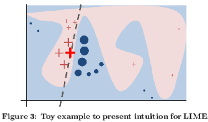

# LIME
Paper: https://arxiv.org/abs/1602.04938

## Tl;dr

In its simplest form, LIME is a model-agnostic approach to generate approximate local explanations for a black-box prediction model. LIME generates explanations by approximating the behaviour of a presumably complex model with a simple, interpretable model within the vicinity of given a data point. The authors also suggest an approach to sample and aggregate local explanations to generate 'more global' explanations. The latter approach is referred to as SP-LIME, where SP is an acronym for submodular pick - a reference to the greedy nature of the algorithm.

## Motivation

> If the users do not trust a model or prediction, they will not use it.

> It is important to differentiate between two different [...] definitions of trust: (1) trusting a prediction [...] and (2) trusting a model.

> We note that explanations are particularly useful [...] if a method can produce them for any model, so that a variety of models can be compared.

## Local explanations

The authors point out the notion of local fidelity:

> [...] for an explanation to be meaningful it must at least be locally faithful, i.e. must correspond to how the model behaves in the vicinity of the instance being predicted.


In other words, we would like to 'optimally' choose a substitute model for our complex model, where optimality seeks to simulaneously capture two concerns:
* the interpretability of our new, simple model (let's call this surrogate)
* the approximation error between the surrogate and the original, complex model

More formally, the authors define:
* $f$, the original model
* $G$ the class of possible, interpretable surrogate models
* $\Omega(g)$, a measure of complexity for $g \in G$
* $\pi_x(z)$ a proximity measure of $z$ wrt data point $x$
* $\mathcal{L}(f, g, \pi_x)$ a measure of how unfaithful a $g \in G$ is to $f$ in the locality defined by $\pi_x$

Given all of these objects as well as a to be explained data point $x$, the authors suggest that the most appropriate surrogate $g$, also referred to as explanation for $x$, $\xi(x)$, can be expressed as follows:

$$ \xi(x) = argmin_{g' \in G} \mathcal{L}(f, g', \pi_x) + \Omega(g')$$

## Local explanations in practice

> In order to learn the local behavior of  $f$ as the interpretable inputs vary, we approximate $\mathcal{L}(f, g, \pi_x)$ by drawing samples, weighted by $\pi_x$. 

> Given a perturbed sample [...] obtain $f(z)$ which is used as a label for the explanation model. Given this dataset $\mathcal{Z}$ of perturbed samples with associated labels, we optimize to get an explanation $\xi(x)$.

The authors illustrate the more general approach from above by instantiating some of the more abstract objects:

* $G$: the class of linear models
* $\mathcal{L}$: locally-weighted square loss on drawn samples
* $\pi_x(z) = \exp(\frac{-D(x, z)^2}{\sigma^2}) given some distance function $D$
  * They suggest e.g. the $L2$ distance or cosine distances

### Example

The authors present an example illustrating the difference between $f$ and $g$ in figure 3.



Here, the large red cross represents $x$. The blue and rose background represents the discrimination learned by the black-box classifier $f$. The dotted line represents the surrogate model $g$ or explanation $\xi(x)$. The other points are random perturbations of $x$ sampled in accordance with $\pi_x(z)$ for which labels have been obtained by predicting with $f$.

## Towards global explanations

> We represent the time/patience that humans have by a budget $B$ that denotes the number of explanations they are willing to look at in order to understand a model.

As a consequence, the authors embark on the challenge to select $B$ explanations to best convey an explanation or interpretation of the black-box model's behavior. Assuming a pre-existing notion of local feature importance, e.g. the magnitude of a weight in a linear model $g$ used to explain data point $x$, the authors suggest to construct the notion of global feature importance for a collection of data points $X$. Concretely, they mention to have used the following in one of their applications:

$$ \mathcal{I}_j = \sqrt{\sum_{i=1}^n W_{ij}}$$

where $\mathcal{I}_j$ is the global feature importance of feature $j$ and $W_{ij}$ is the local feature importance of feature $j$ for the $i$-th data point.

Intuitively, the authors suggest to select a pool of explanations which
* have little redundancy between each other
* showcase the features with highest global importance

In line with this ambition, they define a notion of 'coverage' as follows:

$$ c(V, W, \mathcal{I}) = \sum_{j=1}^{d} I[\exists i \in V, W_{i,j} > 0] \mathcal{I}_j$$

where
* $d$ is the number of features
* $V$ is the candidate set of explanations to be shown to humans, within budget $B$
* $W$ is a $n \times d$ local feature importance matrix and
* $\mathcal{I}$ is a $d$-dimensional vector of global feature importances

This translates to the following greedy algorithm, given a dataset `X` and a budget `budget`:

```python
all_explanations = [explain(x) for x in X.observations]
global_importances = [global_importance(all_explanations) for feature in X.features]
selected_explanations = set()
while len(selected_explanations) < B:
	greedy_choice = argmax(
	    candidates=X.observations,
		function=coverage(explanations, global_importances, selected_explanations)
	)
    selected_explanations.add(greedy_choice)
return selected_explanations
```

This algorithm is not to be expected to return an optimal set of explanations $V$. Yet, thanks to this problems' submodularity, the coverage achieved is guaranteed to be no less than $1 - \frac{1}{e}$ of the optimal coverage.
